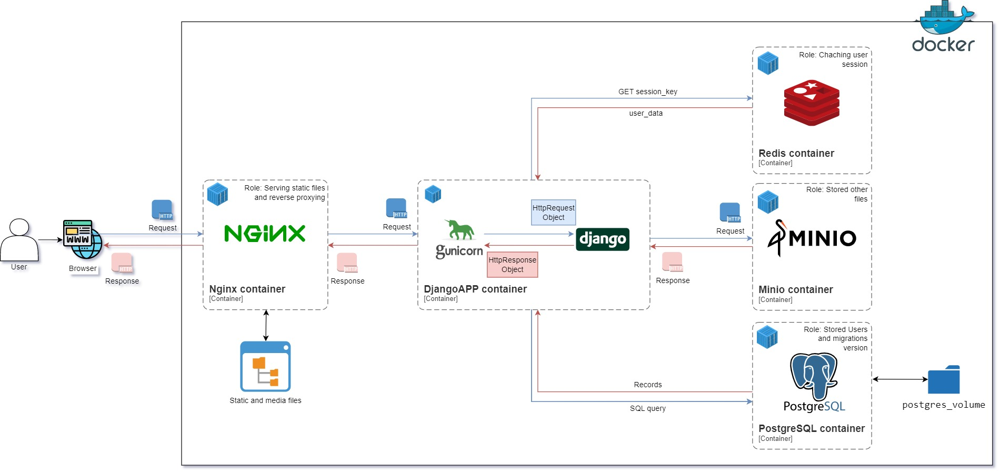
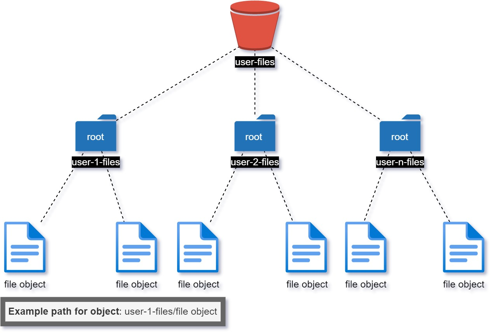
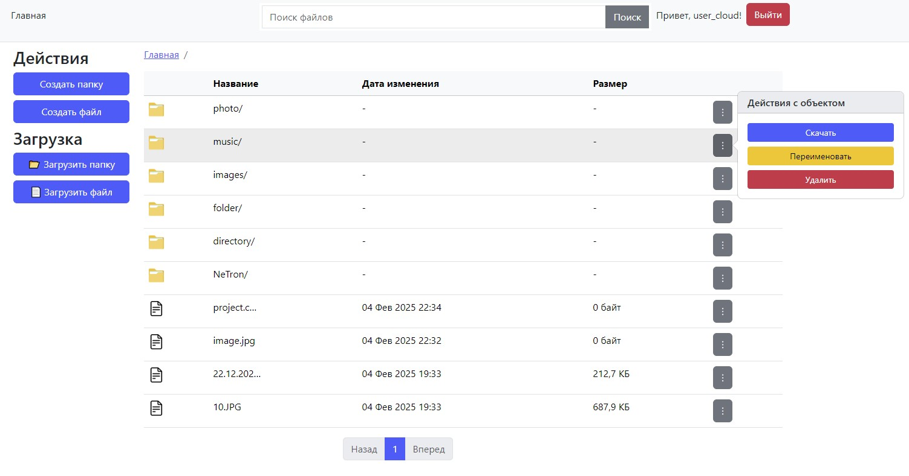
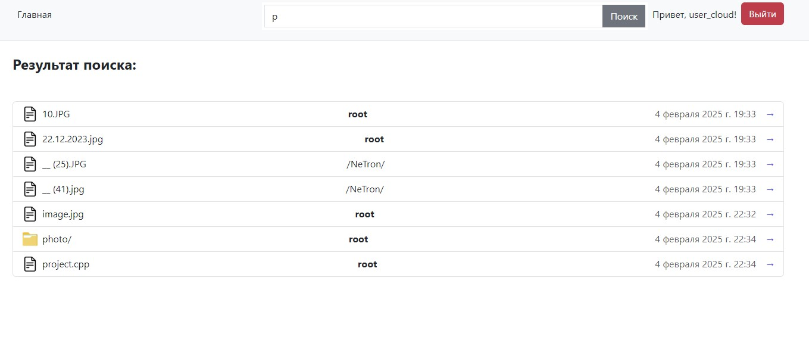

# Облачное хранилище файлов

Многопользовательское файловое облако. Пользователи сервиса могут использовать его для загрузки, хранения файлов и работы с ними. 

Проект создан в рамках **Python Roadmap Сергея Жукова** -> [ссылка](https://zhukovsd.github.io/python-backend-learning-course/)
  

<p align="center">
  
</p>

## Запуск проекта
<ol>
  <li>Выполните клонирование проекта <code>git clone https://github.com/Wh4tisl0ve/Cloud_file_storage.git</code></li>
  <li>Выполните установку Docker</li>
  <li>Создайте .env файл в директории <code>cloud_storage</code> и заполните переменные окружения</li>
</ol>

**Для dev-версии проекта:**
<ol start="4">
  <li>Выполните команду <code>docker-compose up -d --build</code></li>
  <li>Выполните команду <code>poetry run python manage.py runserver</code> из директории <code>cloud_storage</code></li>
  <li>Приложение доступно по адресу localhost:8000</li>
</ol>

**Для prod-версии проекта:**
<ol start="4">
  <li>Выполните команду <code>docker-compose up -f docker-compose.prod.yaml -d --build</code></li>
  <li>Приложение доступно по адресу ${your_ip}:8000</li>
</ol>


## Пример .env 
```env
#### Django-App
DEBUG=Режим отладки(False - выключен, True - включен)  
SECRET_KEY=Cекретный ключ для Django  
ALLOWED_HOSTS=Список доменов, которые может обслуживать приложение  

#### DB-config
POSTGRES_DB=cloud_storage  
POSTGRES_USER=Имя пользователя от БД  
POSTGRES_PASSWORD=Пароль от БД  
POSTGRES_HOST=Хост, используемый для подключения к PostgreSQL  
POSTGRES_PORT=Порт, используемый для подключения к PostgreSQL(по умолчанию 5432)

#### Redis-config
REDIS_PASSWORD=Пароль от Redis  
REDIS_HOST=Хост, используемый для подключения к Redis  
REDIS_PORT=Порт, используемый для подключения к Redis (по умолчанию 6379)

#### Minio config
MINIO_HOST=Хост, используемый для подключения к Minio  
MINIO_PORT=Порт, используемый для подключения к Minio (по умолчанию 9000)  
MINIO_BUCKET_NAME=user-files  
MINIO_ACCESS_KEY=Логин для доступа к пользовательскому интерфейсу MinIO  
MINIO_SECRET_KEY=Пароль для доступа к пользовательскому интерфейсу MinIO   
```

## Структура приложений Django

* [cloud_storage/config](cloud_storage/config) - Приложение, содержащее настройки Django
* [cloud_storage/users](cloud_storage/users) - Приложение, отвечающее за работу с пользователями
* [cloud_storage/cloud](cloud_storage/cloud) - Приложение, отвечающее за работу с основной логикой облачного хранилища

## Архитектура проекта
Проект состоит из 5 сервисов:
1. nginx - служит для обработки статических файлов и проксирования запросов
2. Django + gunicorn - служит для реализации основной логики проекта и корректной обработки запросов
3. Redis - используется для хранения пользовательских сессий
4. Minio - используется для хранения файловых объектов
5. PostgreSQL - содержит в себе служебные таблицы Django и хранит информацию о пользователях приложения



## Структура S3 хранилища

Для хранения файлов всех пользователей в проекте существует бакет user-files. В корне бакета для каждого пользователя создана папка с именем в формате user-${id}-files, где id является идентификатором пользователя. 

Каждая из таких папок является корнем для хранения папок данного пользователя.



## Основные операции с объектами хранилища

* Создание файлов/папок
* Переименовывание файлов/папок
* Загрузка файлов/папок
* Скачивание файлов/папок(в виде .zip архива)
* Удаление файлов/папок

## Описание страниц проекта
### Страница авторизации
Адрес - `/accounts/login`.
Представляет собой форму для авторизации пользователей. 


### Страница регистрации
Адрес - `/accounts/register`. 
Представляет собой форму для регистрации пользователей. 


### Главная страница
Адрес - `/?path=$path_to_subdirectory`. 
Представляет собой главную страницу приложения. Параметр $path задаёт путь просматриваемой папки. Если параметр отсутствует, подразумевается корневая папка. 



### Страница поиска файлов
Адрес - `/search/?query=$search_query`.
Параметр $query представляет собой текстовый запрос пользователя для поиска по имени.
Представляет собой страницу результата поиска файлов. 



## Тесты
В качестве фреймворка для тестирования был использован unittest.
Юнит тестами был покрыт основной функционал приложения. 
Основные тест-кейсы:
* Проверка корректности создания файла/папки
* Если файл/папка уже существует, то этот объек не будет перезаписан и пользователь получит понятное описание ошибки
* Удаление файла/папки
* Переименование файла/папки
* Поиск файла/папки
* Проверка доступа только к разрешенным объекта хранилища

## Стек 

* Python 3.12
* Poetry
* Django 5.1.2
* PostgreSQL
* Minio
* Redis
* Docker
* unittest
* HTML/CSS(Bootstrap5)/JS
